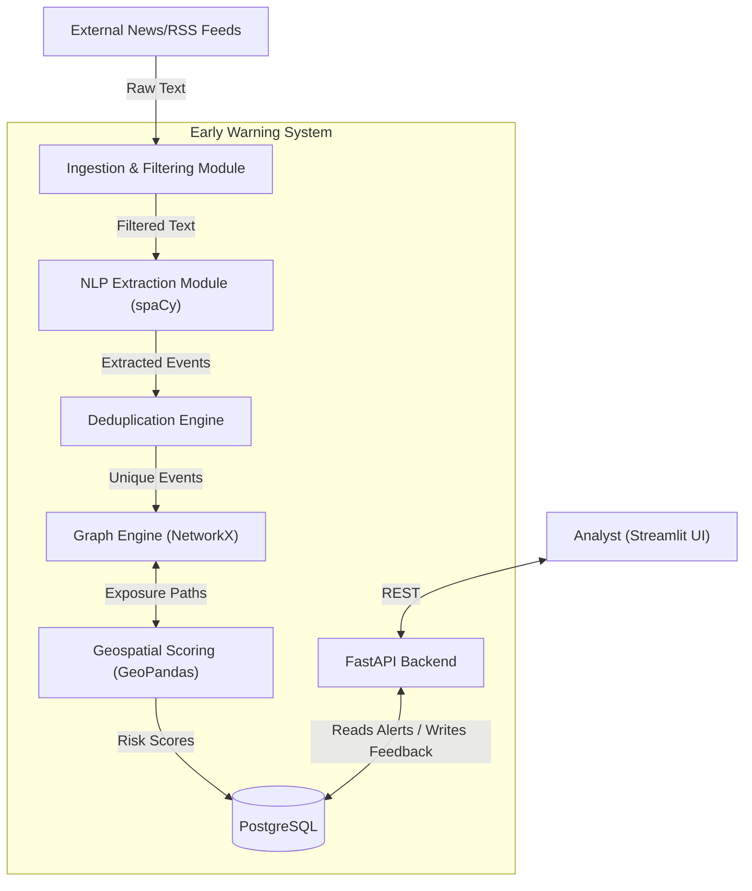
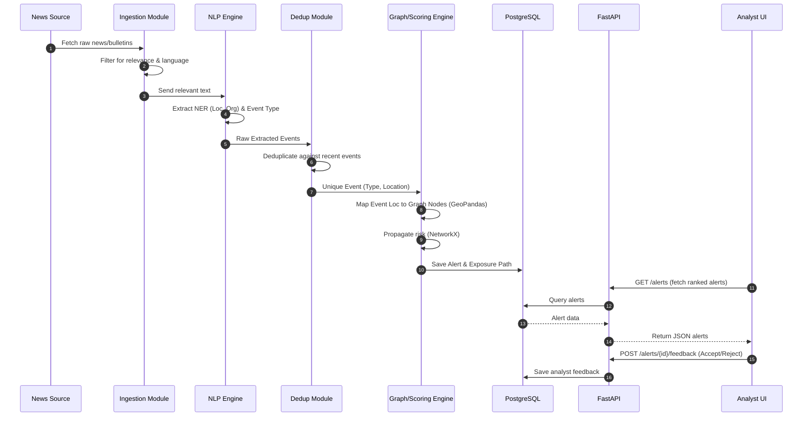

# System Architecture

## C4 Component Diagram

```mermaid
flowchart TD
    %% Users
    Analyst["Analyst (Streamlit UI)"]

    %% External Systems
    NewsFeed["External News/RSS Feeds"]

    %% System Boundary
    subgraph Early Warning System
        API["FastAPI Backend"]
        Ingestion["Ingestion & Filtering Module"]
        NLP["NLP Extraction Module (spaCy)"]
        Dedup["Deduplication Engine"]
        GraphEngine["Graph Engine (NetworkX)"]
        Scoring["Geospatial Scoring (GeoPandas)"]
        
        DB[(PostgreSQL)]
    end

    %% Relationships
    NewsFeed -->|Raw Text| Ingestion
    Ingestion -->|Filtered Text| NLP
    NLP -->|Extracted Events| Dedup
    Dedup -->|Unique Events| GraphEngine
    GraphEngine <-->|Exposure Paths| Scoring
    Scoring -->|Risk Scores| DB
    
    API <-->|Reads Alerts / Writes Feedback| DB
    Analyst <-->|REST| API
```

## End-to-End Sequence Diagram

```mermaid
sequenceDiagram
    autonumber
    participant Source as News Source
    participant Ingest as Ingestion Module
    participant NLP as NLP Engine
    participant Dedup as Dedup Module
    participant Graph as Graph/Scoring Engine
    participant DB as PostgreSQL
    participant API as FastAPI
    participant UI as Analyst UI

    Source->>Ingest: Fetch raw news/bulletins
    Ingest->>Ingest: Filter for relevance & language
    Ingest->>NLP: Send relevant text
    NLP->>NLP: Extract NER (Loc, Org) & Event Type
    NLP->>Dedup: Raw Extracted Events
    Dedup->>Dedup: Deduplicate against recent events
    Dedup->>Graph: Unique Event (Type, Location)
    Graph->>Graph: Map Event Loc to Graph Nodes (GeoPandas)
    Graph->>Graph: Propagate risk (NetworkX)
    Graph->>DB: Save Alert & Exposure Path
    UI->>API: GET /alerts (fetch ranked alerts)
    API->>DB: Query alerts
    DB-->>API: Alert data
    API-->>UI: Return JSON alerts
    UI->>API: POST /alerts/{id}/feedback (Accept/Reject)
    API->>DB: Save analyst feedback
```
